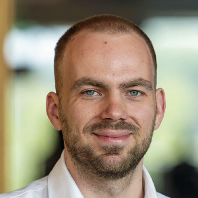
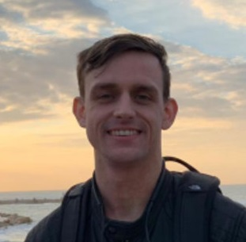
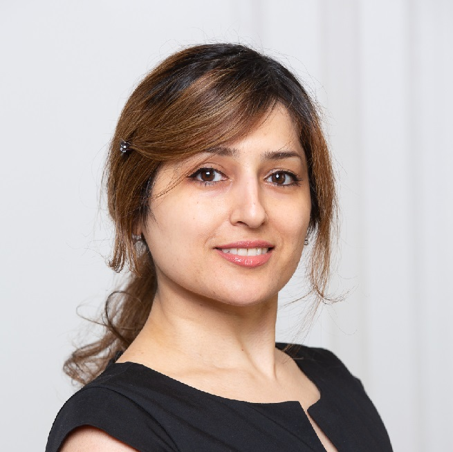

# Teachers

&nbsp;
&nbsp;

|Dr Elco Koks|Course coordinator|
|:-:|:--|
|  |Elco Koks is an Associate Professor within the department of Water and Climate Risk group at the Institute for Environmental Studies (IVM) and Honorary Research Fellow at the Oxford Programme for Sustainable Infrastructure Systems (OPSIS) at the University of Oxford, UK. His research combines knowledge from disaster impact modelling, critical infrastructure, network analysis and macroeconomics.|
  
&nbsp;
&nbsp;  

|Dr Alex Levering||
|:-:|:--|
||Alex Levering is an Assistant Professor at the department of Environmental Geography and the Institute for Environmental Studies (IVM) at Vrije Universiteit Amsterdam. His background is in remote sensing and geo-information sciences, with a specialisation in computer vision methods. His research focuses on studying the semantics of landscapes from image materials in both natural and urban environments. He has studied how well landscape quality preferences can be predicted using computer vision methods. He has also studied the interpretability of models, the combination of visual and non-visual information for predictive models, and approaches for modelling with small datasets. |

&nbsp;
&nbsp;  

|Dr.-Ing. Shadi Shirazian||
|:-:|:--|
||Shadi Shirazian is a postdoctoral researcher in the department of Water and Climate Risk of the Institute for Environmental Studies (IVM) at Vrije Universiteit Amsterdam (VU). She holds a PhD in Civil Engineering and Environmental Science from the Karlsruhe Institute of Technology (KIT) in Germany, where her research was primarily focused on developing data reduction methodologies for stochastic seismic risk assessment of infrastructures. She develops solutions that not only advance academic understanding but also benefit communities facing the challenges of climate change and natural hazards.|